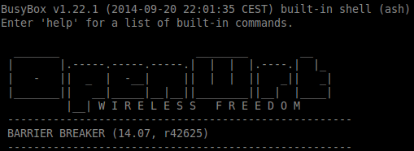
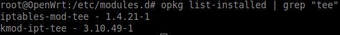

This simple tutorial describes how to configure traffic mirroring on your OpenWRT capable router (using iptables) and send it to Snort IDS. Having an IDS running in your local network sometimes can help find infected machines connected to it, LAN attacks which can lead to sessions hijacking, Man-in-the-middle attacks and other nasty things.

First of all you need an OpenWRT compatible router (see [Official list](https://wiki.openwrt.org/toh/start "OpenWRT Wiki")) with a freshly installed distribution. In this tutorial I’m using a TP-Link TL-WR841ND with 14.07 Barrier Breaker (see screenshot below).



[ {:.post_image} ](../img/openwrt.png)

Use SSH to connect to your network device and install **iptables-mod-tee** package:

```bash
# Update the list of available packages
opkg update
# Check package availability
opkg list | grep "mod-tee"
# Install iptables-mod-tee package
opkg install iptables-mod-tee
 
# Check if package installed successfully
opkg list-installed | grep "mod-tee"
```

After the installation, you should have kmod-ipt-tee package installed automatically as dependency (see screenshot below):

[ {:.post_image} ](../img/openwrt1.png)

## Troubleshooting

A lot of tutorials do not mention the error you can get by trying to add an iptables rule, after the installation. Let’s try to run following command:

```bash
# Add rule to mangle table in POSTROUTING chain
iptables -t mangle -A POSTROUTING ! -s 192.168.1.0/24 -j TEE --gateway 192.168.1.120
```

Most of the time it will result in an error (see screenshot below).

[ {:.post_image} ](../img/iptables.png)

Because iptables-mod-tee is a kernel module it should be loaded before you are trying to get use of it. So, let’s try to load our newly installed module: **xt_TEE**.

```bash
modprobe xt_TEE
```

If it doesn’t work just reboot the device (run: **reboot**). Now we are ready to add iptables rules so the traffic mirroring will work like a charm.

As you probably know, there are 5 tables in iptables:

1. NAT table – used for network address translation (e.g. port forwarding);
2. ROW table – used for configuring packets so that they are exempt from connection tracking;
3. FILTER table – is the default table and is where all actions, associated with the firewall, typically take place;
4. SECURITY table – is used for Mandatory Access Control (SELinux gets use of it);
5. MANGLE table – used for packets alteration actions (e.g. cloning);



The table we need is MANGLE. It permits to modify packets going through our router, or in our case, just to clone them. I used following two rules to implement traffic mirroring:

```bash
iptables -t mangle -A PREROUTING -d 192.168.1.0/24 -j TEE --gateway 192.168.1.120
iptables -t mangle -A POSTROUTING ! -s 192.168.1.0/24 -j TEE --gateway 192.168.1.120
```

Make sure you substitute 192.168.1.0/24 and 192.168.1.120 with correct network and host address, to which all traffic is mirrored. In my case, I have a separate Raspberry PI connected with 192.168.1.120 IP address, running Snort daemon on it.

That’s all folks, now you are able to get all your router’s traffic. Aloha ;)