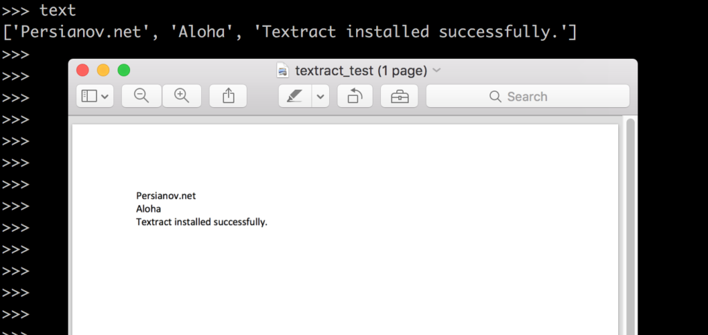

Good day, everyone! This short tutorial explains how to extract text from pdf files, using Python’s textract module. I am going to show you how to install it correctly. So, feel free to leave a comment below.

## Install textract on Ubuntu 16.04 Server.

Let’s begin with the well known and necessary step, like updating repositories:

```bash
apt update
```

After we updated the local information about repositories, let’s install and upgrade `pip`:

```bash
apt install python-pip && pip install --upgrade pip
```

I will not use Python’s virtual environments to keep this guide as simple as possible. Once we have pip installed and updated, let’s install textract‘s dependencies. Run following command on your Ubuntu server:

```bash
apt install python-dev libxml2-dev libxslt1-dev antiword unrtf poppler-utils pstotext tesseract-ocr flac ffmpeg lame libmad0 libsox-fmt-mp3 sox libjpeg-dev swig
```

Basically, these are the steps described on textract [Official Website](https://textract.readthedocs.io/en/stable/installation.html "textract installation guide"). At this stage, if we try and install textract, we’ll face several issues:

```bash
pip install textract
```

## Errors installing textract.

This is the main reason, why I’m writing this tutorial. To save you the hassle.
First issue you can face is during `SpeechRecognition-3.6.3` installation. If pip is unable to install this module, you can do it manually, by running:

```bash
pip install https://pypi.python.org/packages/ce/c7/ab6cd0d00ddf8dc3b537cfb922f3f049f8018f38c88d71fd164f3acb8416/SpeechRecognition-3.6.3-py2.py3-none-any.whl
```

Also, probably you’ll get same issue that I faced, while installing textract. It was pocketsphinx build failure. If you get something like:

```bash
fatal error: pulse/pulseaudio.h: No such file or directory
error: command 'x86_64-linux-gnu-gcc' failed with exit status 1
Failed building wheel for pocketsphinx
```

then you are missing libpulse-dev. What are you waiting for? =))

```bash
apt install libpulse-dev
```

Now, you are good to install textract:

```bash
pip install textract
```

## Extract text from PDF files. Python sample.

```bash
import textract
text = textract.process("/home/user/textract_test.pdf")
```

Here is my result, after processing a dummy PDF file:

{:.post_image}

Congratulations! You successfully installed textract on your Ubuntu Server. I hope you enjoyed this short tutorial.