This is the Part 2 of my Emotet analysis. It covers phase 3 of the attack, specifically the PE file which is being dropped by infected websites, used in Phishing/Spam campaigns. Emotet is an advanced modular Trojan, predominantly used as Malware Distribution Platform, main goal being systems infection with other types of malware.

More information about phases 1 and 2: [HERE](https://persianov.net/emotet-malware-analysis-part-1 "Emotet infection. Phase 1 & 2")

## General information.

Phase 3 of this version of Emotet attack is characterized by the new version of executable. Malware authors spent some time to make it harder to analyze, by implementing multiple Anti-Debugging techniques, loading Windows DLLs dynamically, encrypting imported functions names, several unpacking stages, and so on.

|File name|Checksum|Hosted at|
|---|---|---|
|DFDWiz.exe|cebb919d8d04f224b78181a4d3f0b10a315ae2f2|hxxp://biederman.net/leslie/lL/|

Based on IAT information, there are several Windows DLLs this binary is loading: `kernel32.dll`, `user32.dll`, `gdi32.dll`, `advapi32.dll`, `shell32.dll` and `shlwapi.dll`.

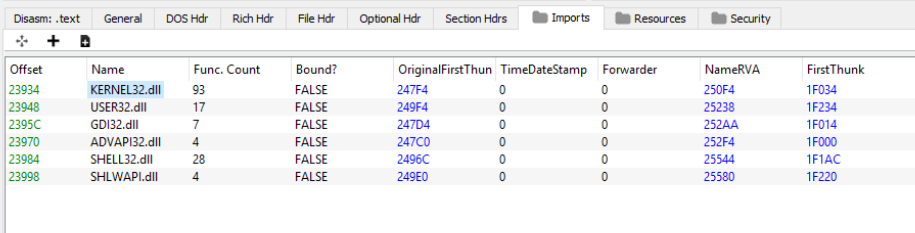{:.post_image}

At the first glance, the binary doesn't import any "red flag" functions, usually used by packers.

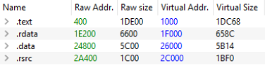{:.post_image}

Let's load this sample in IDA and check for any details that can help in upcoming dynamic analysis. From the multitude of imported functions, listed in IAT, there are only few used (visible at least). One of them is `VirtualAlloc`, which points to a possible custom packer.

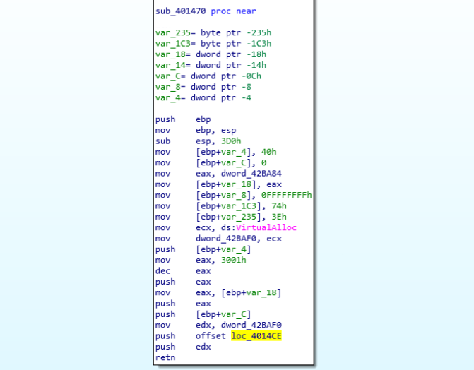{:.post_image}

Some other clues showing that this binary is packed are `call`s to pointers to data segment:

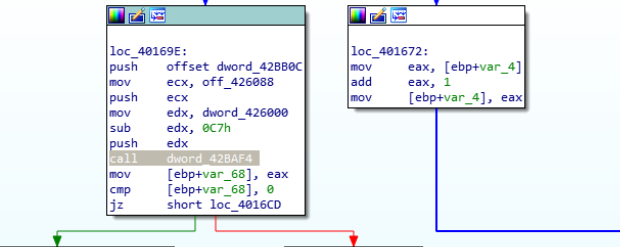{:.post_image}

## Dynamic analysis. Unpacking.

For the dynamic analysis of this sample, I'm going to use `x32dbg`. Based on the report from Hybrid Analysis, looks like this sample creates 2 new processes, once executed: copy of itself and a second process with a different name. This is the packed PE file, which is embedded into the first sample.

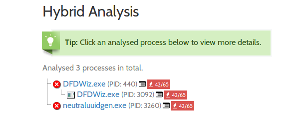{:.post_image}

Most probably, parent process will call one of the `CreateProcess*` Windows API functions. Since 2018, Microsoft moved some functionality from **kernel32.dll** and **advapi32.dll** to new low-level binary, called `kernelbase.dll`. If we take a look at `CreateProcessA` and `CreateProcessAsUserA` in kernel32.dll, the only thing we can see are several `mov` and `push` instructions, followed by a jump, to **kernelbase.dll** equivalent function.

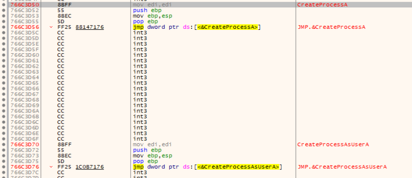{:.post_image}

Following the thread to kernelbase.dll, we see that `CreateProcessA` function contains a bunch of another push instructions followed by a `call` to `CreateProcessInternalA`. Same happens for `CreateProcessAsUserA`.

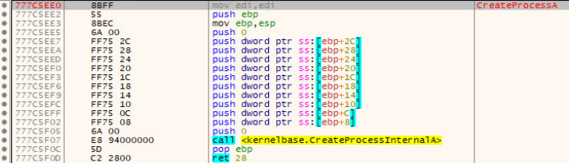{:.post_image}

To keep this short, the overall call chain looks like this:

[kernel32.dll]`CreateProcessA` -> [kernelbase.dll]`CreateProcessA` -> [kernelbase.dll]`CreateProcessInternalA` -> [kernelbase.dll]`CreateProcessInternalW`

It means that for any `CreateProcess*` function call, we'll get `CreateProcessInternalW` called right before process creation. If we set a breakpoint at the beginning of this function, we possibly could find the **unpacked** binary, which is going to be injected into the new process. Once we hit the breakpoint, there are 4 memory regions with **ERW** (Execute-Read-Write) flags set. 3/4 are PE files, based on the header.

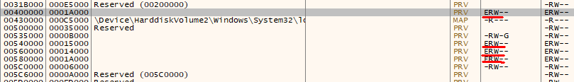{:.post_image}

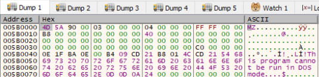{:.post_image}

Once all of them are dumped and properly aligned, we can proceed with the second phase of analysis.

## Dynamic analysis. Dumped binaries.

All 3 exported binaries look the same, even if they have different checksums. IAT table is empty, which means that malware loads dependencies in runtime. There are no API function names in binary's strings, which implies that all API function names are encrypted as well as library names.

The execution starts with 3 function calls.

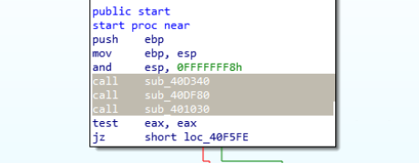{:.post_image}

First 2 functions contain encrypted names of the APIs this sample is going to load dynamically. These functions call another one, once all encrypted values are loaded to stack. The `sub_401550` looks to be responsible for decryption.

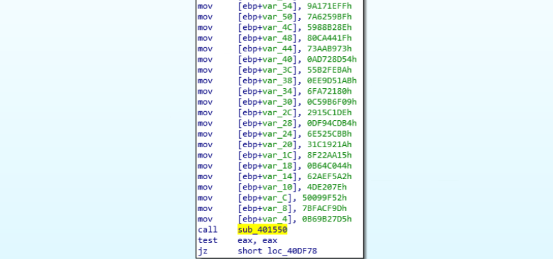{:.post_image}

So far, I was able to detect 4 DLLs loaded dynamically by this sample: `kernel32.dll`, `user32.dll`, `ntdll.dll`, `shell32.dll`.

In order to run just one copy of it, this sample checks if a specific MUTEX exists and creates it, if missing. MUTEX name is: `PEMF24`.

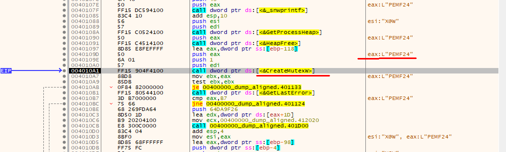{:.post_image}

Once MUTEX is checked/created, malware looks for Windows directory to copy itself there, as well as into **%APPDATA%** folder. This time, the new binary is named differently and this name is generated in runtime by concatenating 2 strings (in my case it was `ipropslide.exe`). All possible strings are stored in memory at some point.

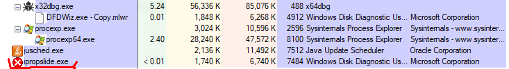{:.post_image}

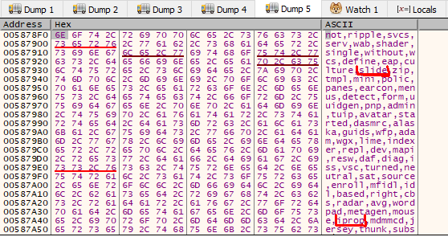{:.post_image}

Once the new process is created, it starts looking for host information like **Computer Name** and **Volume info** and C2 communication begins.

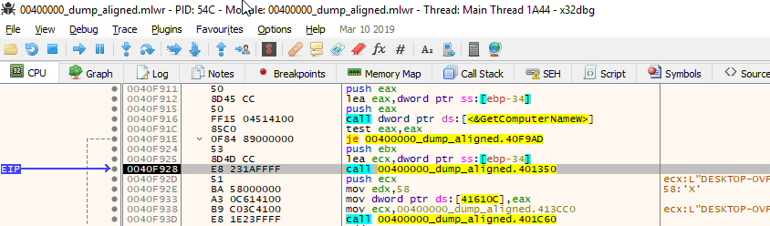{:.post_image}

After some patching during debugging and several failures =)) I was able to get some details about the C2 communication part. Sample tries to connect to 3 IP addresses (round robin?)

|IP Address|Destination Port|Protocol|User Agent|
|---|---|---|---|
|45.36.20[.]17|8443|HTTP|Mozilla/4.0 (compatible; MSIE 6.0; Windows NT 5.1; SV1; .NET CLR 2.0.50727; .NET CLR 3.0.04506.648; .NET CLR 3.5.21022)|
|103.39.131[.]88|80|HTTP|Mozilla/4.0 (compatible; MSIE 6.0; Windows NT 5.1; SV1; .NET CLR 2.0.50727; .NET CLR 3.0.04506.648; .NET CLR 3.5.21022)|
|86.239.117[.]57|8090|HTTP|Mozilla/4.0 (compatible; MSIE 6.0; Windows NT 5.1; SV1; .NET CLR 2.0.50727; .NET CLR 3.0.04506.648; .NET CLR 3.5.21022)|

## Conclusion.

Malware authors did a good effort in packing this malware and introducing different layers of defence. It wasn't too difficult to bypass those layers, however taking into consideration how often a new Emotet version is released and the changes to the binary, the analysis becomes time consuming in the long term.
Sending HTTP traffic to non-standard destination ports, like `8090`, is not the best way to keep a low profile in a compromised network. Most businesses have to treat this type of traffic as suspicious nowadays and maintain a clean asset inventory.