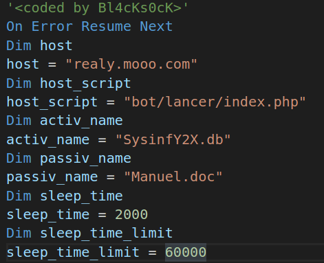
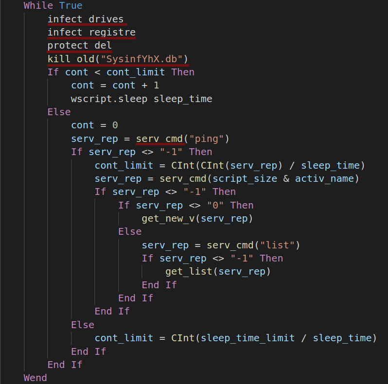
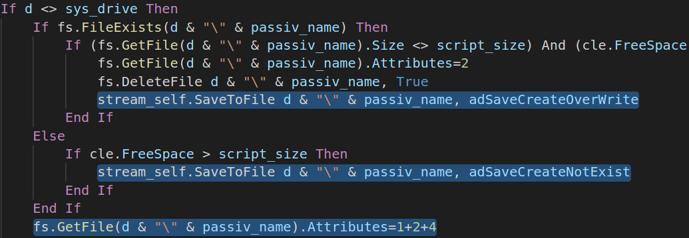

Anyone heard about Forbix worm? Good. Lots of us know how difficult is to remove a worm from an infected system or network. Of course it depends on multiple factors, like: the way it spreads, persistence mechanisms, disguise techniques used once machine is infected, reinfection methods, etc. These days, when someone says "Windows worm" we usually expect a highly sophisticated piece of malware, exploiting a 0-day/1-day vulnerability and "preferably" this vulnerability being in a service listening on a specific port exposed to the whole world. May be this is the case of the worm like ransomware WannaCry, but definitely not applicable to Forbix malware.

Not so long ago (year 2019), I got hold of a PC which kept beaconing to a C2 server even after being re-imaged several times. And nope, the image was clean.
Based on the domain name this malware kept trying to connect, it was very easy to determine that it is Forbix indeed. This worm is about 3 years old, written in Visual Basic and not obfuscated at all, yet it kept reappearing after that PC was re-imaged several times.


## General information

Forbix is a Windows worm written purely in Visual Basic. First references about it date March 2016. Based on the sample found recently, looks like it wasn't updated since then, however this strain is still alive even since now.

|File name|Checksum|Size|
|---|---|---|
|Manuel.doc|d838aaf8d656b7d8d0f48d13646e677eaad35f20|11.1K|
|SysinfY2X.db|d838aaf8d656b7d8d0f48d13646e677eaad35f20|11.1K|
|SysinfY2X.db (decoded)|e41c395013e1a72477eb4b02429d38d0eef2e82e|10.2K|

There are several states this malware can be. As described later in this article, there is are `Active` and `Passive` states. Forbix is stored on the disk in it's passive state which is the encoded version of the actual script (VBE script). This is performed with Microsoft's default VBScript.Encode functionality. Because of this particularity, multiple AV solutions do not flag it as malicious, as it is not a executable file.

{:.post_image}

I was surprised to see that, at the time of this writing, about a half of VirusTotal engines do not find the decoded version malicious (28/53): **MalwareBytes**, Comodo, F-Secure, F-Prot, Avira. It gets even more interesting when I change the C2 domain and the names of files this malware creates: 21/53. This time **Kaspersky**, **Microsoft Defender**, **Sophos**, **McAfee** and **ClamAV** also made into the list. 


## Forbix .LNK files

You are probably wondering already how this .vbe script gets executed on victims machine? Well it's all about .LNK files. They are created on an infected machine, replacing original folders.

```bash
"C:\Windows\system32\cmd.exe" /c start wscript /e:VBScript.Encode Manuel.doc & start explorer <REPLACED_FOLDER_NAME>
```

Once double clicked this .LNK file executed the VBE Script from Manuel.doc and then opens the hidden original folder. This way most of the users never suspect that something is wrong.


## Forbix `SysinfY2X.db` file

In its stored *(passive)* state this file is similar to Manuel.doc and is an encoded version of the malware. Because the author used default VBS encoder provided by Microsoft it is easy to obtain the original version. Thanks to [Didier Stevens for this awesome script](https://blog.didierstevens.com/2016/03/29/decoding-vbe/ "Decoding VBE files").

```python
python decode-vbe.py SysinfY2X.db > decoded_sysinfy2x.vbs
```

Once successfully decoded, let's analyse the script, which by the way isn't even obfuscated. From the beginning of the file we already see a bunch of global variables, 
which are never changed during the script execution. These can easily make into our IOCs list.

{:.post_image}

Looks like the C2 Server was behind realy[.]mooo[.].com. Here an interesting fact: By changing these variables' values, **Windows Defender**, **Kaspersky** and **Sophos** AVs stop 
picking up this malware. Looks like we are still in the Era of Strings Searching and Matching.

Following is the main *(infinite)* loop of the worm. It runs every 2 seconds and connects to C2 server every 60 seconds. This sample has 5 major functionalities:

- Infect available drives;
- Add persistence;
- Protect itself against removal;
- Self update and execute stage 2 payload;
- C2 communications;

All these are implemented in the following functions: `infect_drives`, `infect_registre`, `protect_del`, `kill_old`, `serv_vmd`, and all of them are called inside the infinite loop.

{:.post_image}

### infect_drives() function

This function checks for all available drives and infects only **removable**, **CD-ROM** and **network drives** (`DriveType: 1, 3, 4`), avoiding the System Drive. 

{:.post_image}

First step in drives infection is the self replication. Malware checks if the selected drive is not the System Drive and copies itself to the root directory of the drive. 
If Manuel.doc already exists, this file is overwritten. Also, once created, the attributes of this file are set to **ReadOnly**, **Hidden** and **System** (`Attribute: 1, 2, 4`).

{:.post_image}

Next phase is about .LNK files creation and hiding original files. This also applies to folders; malware changes folders attributes making them hidden and creates .LNK files using the same name and icon. As mentioned earlier, by means of .LNK files this malware infects new machines via USB drives, CDs and Network drives.

{:.post_image}

### infect_registre() function

It is responsible for making the malware persistent. It creates one new Registry Key named with the current active name of the program inside `\Software\Microsoft\Windows\CurrentVersion\Run\`. 

{:.post_image}

### protect_del() function

This function is responsible to maintain an up-to-date copy of the script in Windows temporary directory, by overwriting the existing one *(if any)*.

{:.post_image}

### kill_old() function

In order to keep just one (newest) version of the worm running, function `kill_old` is called periodically to remove the remaining artifacts of the previous Forbix.A version.

{:.post_image}

## C2 communications

During the self update process, `get_new_v` and `bot_up` functions are called. These are responsible for preparing files of the new version of the worm and executing it respectively. 
Besides that, `bot_up` function is also used to execute stage 2 modules, which are being downloaded from the C2 server.

C2 communications with the server is implemented around 3 commands:

- `ping` - used to notify the attackers that bot is running;
- `list` - used in stage 2 infection. It contains these parameters:
    - `from` - Stage 2 payload URL;
    - `size` - Size of the payload;
    - `to` - Destination folder to copy the executable;
    - `lancer` - Optional. Specifies the way to execute the payload (wscript.exe, etc.);
- `<size>+<name>` - Used to get new version of malware;


## Conclusion

Since early 2016 Forbix was found in the wild, infecting Windows PCs. Even if it doesn't use any sophisticated techniques to spread, persist and load payloads, multiple AV engines still
fail to detect and remove it. Looks like there are still multiple requests to realy[.]mooo[.]com domain nowadays. If you have an old USB drive and not sure to access the files on it or not, make sure to scan it. Before opening any folder or file, check if "Manuel.doc" file exists in the root directory of the drive.