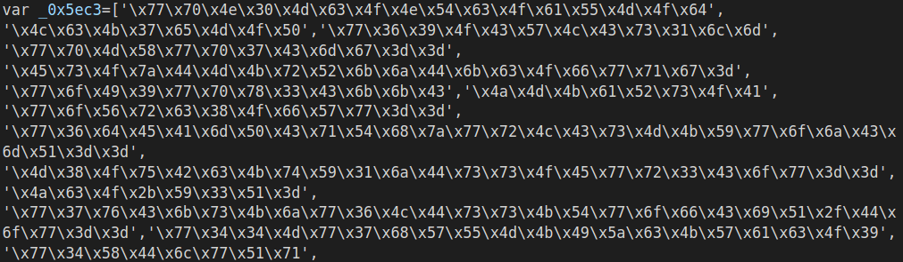
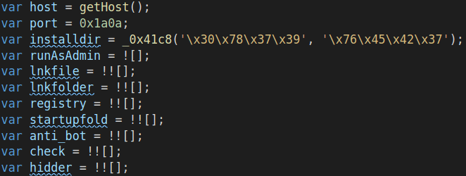
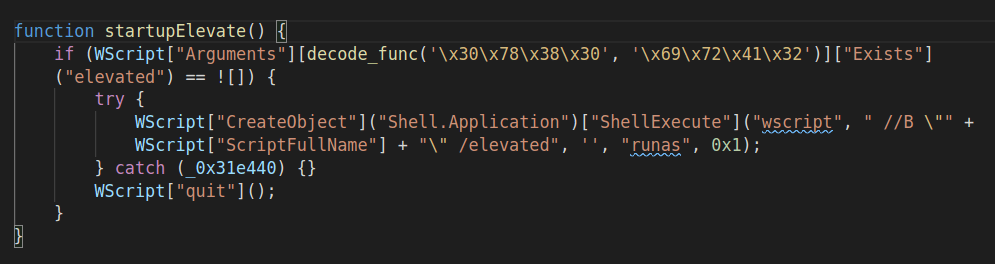
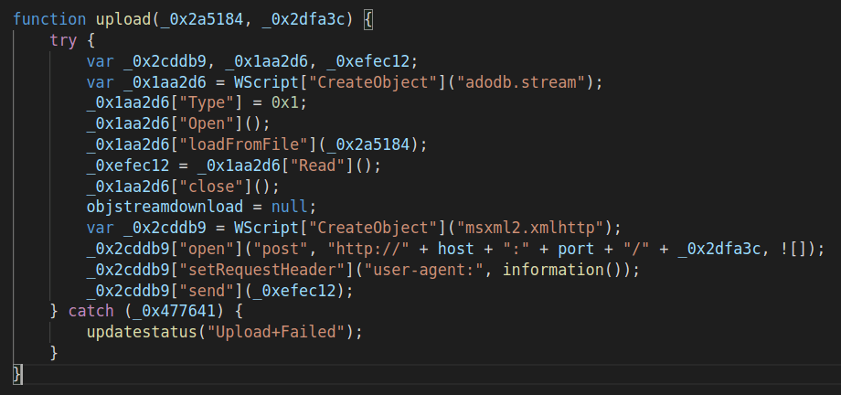
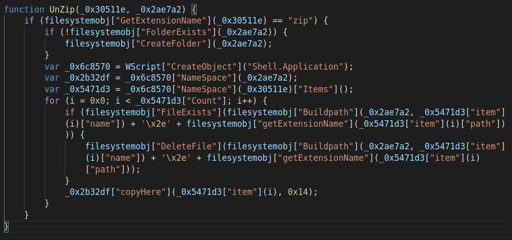
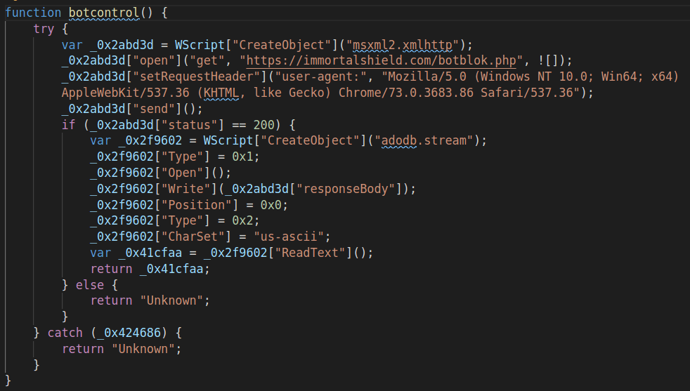
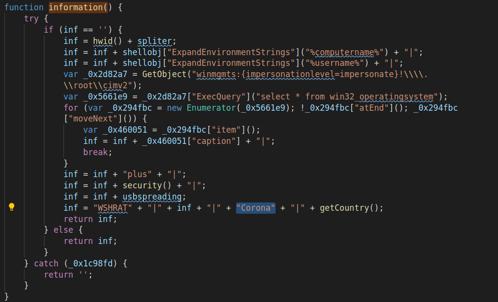

Everybody is talking about the coronavirus pandemic, caused by Covid-19. Media is all about it, news published every minute, interviews with top scientists are being held, multiple websites create to track the spread and governments sending emails/SMS notifications to population about latest measures. It's everywhere. Besides all these, multiple security companies confirmed a spike in online scams, phishing attacks and "coronavirus" malicious files. There was a 667% spike in phishing attacks since February, 2020, due to coronavirus fears. Everybody is in rush, people stockpiling and cybercriminals adapting their tools and exploiting unsuspicious users, connected to Internet more than ever.

Recently, I've stumbled across a website reported by [@JayTHL](https://twitter.com/JayTHL "JayTHL Twitter"), which hosted a malicious JavaScript file named `corona.js`. As of the time of writing this article, it is still available on `45[.]76[.]189[.]29` and not blocked by Google Safe Browsing. Since it serves the script without executing it, I think it's safe to assume that this is stage 2 of the attack (or 3, 4, X-1 where X is the last stage). Based on the articles sharing same IOCs, it looks like attackers were sending emails

## General overview

This particular version of WSHRAT was obfuscated using publicly available, free JS obfuscator. It starts with a variable containing the majority of methods, the script calls. All this information being encoded (**bitwise** operations), then **base64** encoded and the resulting string stored as in its **HEX** representation.

{:.post_image}

From the start an anonymous function is created and called, which shuffles around the elements in `_0x5ec3` array, preparing it for the latter use. Right after the permutations are completed, there is a function definition, called `_0x41c8`. The interesting part about it is that script calls it ~500 times, which could mean that it implements some kind of decoding/decryption functionality.

{:.post_image}

By default, it is not meant to run as Administrator `var runAsAdmin = ![]`. This variable is never changed to true, however there is `startupElevate()` function which tries to run the script with elevated privileges. It kills the script if fails. Also, the script elevates to high privileged user only if it gets a request from C2 server.

{:.post_image}

The general execution flow of this sample is following:

- Shuffles data array;
- Initializes flags and variables;
- Checks if bot is disabled remotely (`killswitch`);
    - Self destruction if killswitch enabled;
- Hides itself;
- Runs AV checks;
    - Self destruction if AV checks failed;
- Gets drive serial number;
    - Self destruction if fails;
- Elevates privileges (activated remotely by attackers);
    - If elevated successfully:
        - Disables UAC;
        - Allows Admin to perform operations without consent or credentials (`ConsentPromptBehaviorAdmin = 0x0`);
        - Disables `AntiSpyware` in Windows Defender;
- Sets USB spreading flags;
- Runs in an infinite loop:
    - Self install function (in case was removed from the disk);
    - Starts beaconing every 2 seconds;
    - Executes command received from the C2 server;

This recent version of the WSHRAT is different than the older versions, analyzed by other researchers. It has some features removed and others renamed, more details below. Also, an interesting finding is that it lacks `offline-keylogger` functionality, however the C2 server sent this as the first command to my forged request.

## Functionality analysis

This particular version of the WSHRAT has **17** possible commands. Some of them, found in older campaigns, are missing (e.g. `offline-keylogger`). Below is the list of features implemented in "corona" version.

|Name|Description|
|---|---|
|disconnect|Script quits and disconnects from C2 server|
|reboot|Reboots infected machine. Needed to disable UAC and Windows Defender|
|shutdown|Shuts down the system|
|execute|Executes any JS code received from C2 server, by calling `eval()`|
|update|Overwrites current version of the script with a new one, received from C2 server|
|uninstall|Removes itself and all modules in its folder|
|up-n-exec|Downloads and executes a payload from the hardcoded IP address/domain name|
|down-n-exec|Downloads and executes a payload from a URL, specified by the C2 server|
|cmd-shell|Executes CMD instructions, writes the results to `out.txt` file and sends the contents to C2 server|
|get-processes|Enumerates processes on the infected machine and sends the list to the attacker|
|disable-uac|Disables UAC, Admin Consent Prompt Behavior and Windows Defender|
|check-eligible|Checks some eligibility criteria, based on the presence of a specific file. The full path to that file is received from the C2 server|
|force-eligible|Creates the "eligible" environment, by creating a file. Requires Administrator privileges|
|elevate|Tries to elevate privileges|
|if-elevate|Privileges check|
|kill-process|Kills a process, specified by C2 server, by running `taskkill`|
|sleep|Sleeps for a specific time|

An interesting detail is that the script opens its file making it impossible to delete by other processes. Attackers usually close the handle during execution of `update` and `elevate` commands.

There are several implemented functions which are never called. This could mean that attackers are still developing this script, however I tend to assume that they reused it and modified as they needed. Why not using some code you already spent time writing, right?

### upload(file_to_upload, c2_api_endpoint)

This function creates an `adodb.stream` to load the file from the disk and sends it to the hardcoded C2 server IP address/domain name on port `6666`, via a `POST` request. The `User-Agent` header contain information about the infected system. Function `information()` is described later in this article. By providing the API endpoint it makes the backend infrastructure flexible and communication not being tightly coupled.

{:.post_image}

### UnZip(archive_full_path, destination_folder)

This is another unused function. It only works with `zip` archives. While forging HTTP requests, I was able to retrieve a `tar.gz` archive from attackers' C&C server, which makes me think that there was some issues updating the version on the script hosted at `http://45[.]76[.]189[.]29/corona.js`.

{:.post_image}

### botcontrol()

Killswitch - that's all. However... =)) I couldn't find other versions of the same RAT which implement this and the `offline-keylogger` functionalities at the same time. I assume that `botcontrol()` was added recently, while malware was stripped (probably to avoid detection by adding one extra phase, where keylogger is downloaded)

{:.post_image}

### information()

Used to get information about the host, like: computer name, user name, operating system, Security Center version, USB spreading flags, country code, provider name. It also contains `Corona` tag, which specifies the campaign the infected host is part of.

{:.post_image}

An example of user agent generated using this function looks something similar to this:
`WSHRAT|0A87-85F9|RickRollPC|Rick|Microsoft Windows 7 Enterprise|plus|non-av|true - 27/3/120/Corona|GB:Provider`

## IOCs

|Type|Name|Checksum|
|---|---|---|
|URL|http://45[.]76[.]189[.]29/corona.js|N/A|
|File|corona.js|d8aa30c5c015d099888507212b1c1623552a385d|
|URL|https://immortalshield[.]com/botblok[.]php|N/A|
|URL|http://doughnut-snack[.]live/klplu.tar.gz|N/A|
|URL|http://139[.]180[.]152[.]57:6666|N/A|

## Final thoughts

Attackers are in a hurry in my opinion. By trying to catch up with the Coronavirus events, some mistakes have been made in updating the malware. I think they are in the middle of moving to new backend version and infrastructure.

Stay safe!